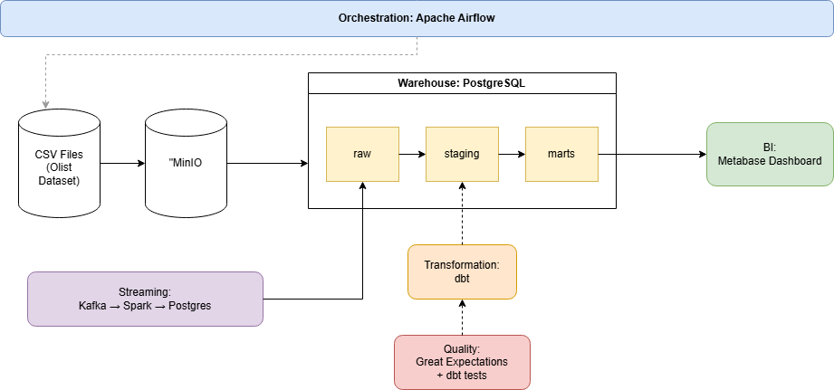

# ecommerce-data-platform
End-to-end data engineering pipeline using the modern data stack
# E-commerce Data Platform

End-to-end data engineering pipeline using the modern data stack — locally runnable with Docker, zero cloud cost.



## Quick start

```bash
git clone https://github.com/abiralpokhrel-learns/ecommerce-data-platform.git
cd ecommerce-data-platform
cp .env.example .env
docker-compose up -d
```

Then visit:
- Airflow: http://localhost:8080 (admin / admin)
- Metabase: http://localhost:3000
- MinIO Console: http://localhost:9001 (minioadmin / minioadmin)

## Stack

| Layer | Tool |
|---|---|
| Containerization | Docker Compose |
| Object Storage | MinIO |
| Warehouse | PostgreSQL 15 |
| Orchestration | Apache Airflow 2.8 |
| Transformation | dbt-core 1.7 |
| Quality | Great Expectations + dbt tests |
| Streaming | Apache Kafka + Spark Structured Streaming |
| BI | Metabase |
| CI/CD | GitHub Actions |

## Documentation

See `docs/project_brief.md` for the full problem statement and design decisions.

## Status

Work in progress. See [Phases](#phases) below for current state.

## Phases

- [x] Phase 1: Setup
- [ ] Phase 2: Docker environment
- [ ] Phase 3: Raw ingestion
- [ ] Phase 4: MinIO
- [ ] Phase 5: Airflow orchestration
- [ ] Phase 6: dbt staging
- [ ] Phase 7: Star schema
- [ ] Phase 8: Data quality
- [ ] Phase 9: Streaming
- [ ] Phase 10: BI + CI/CD